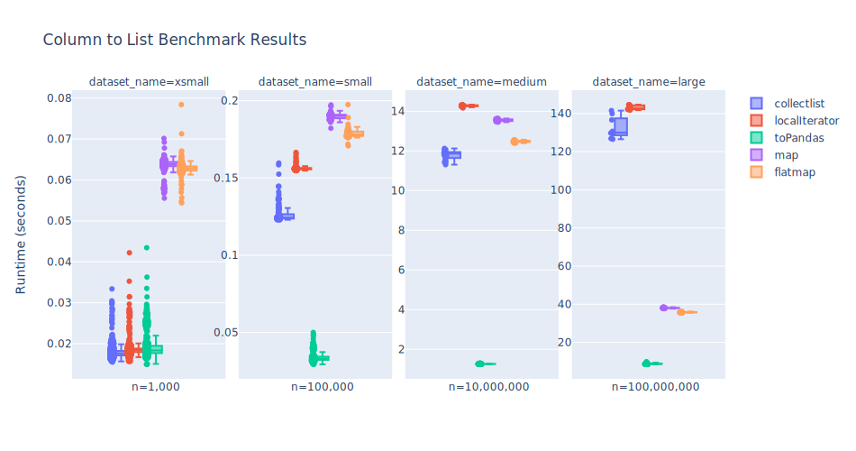
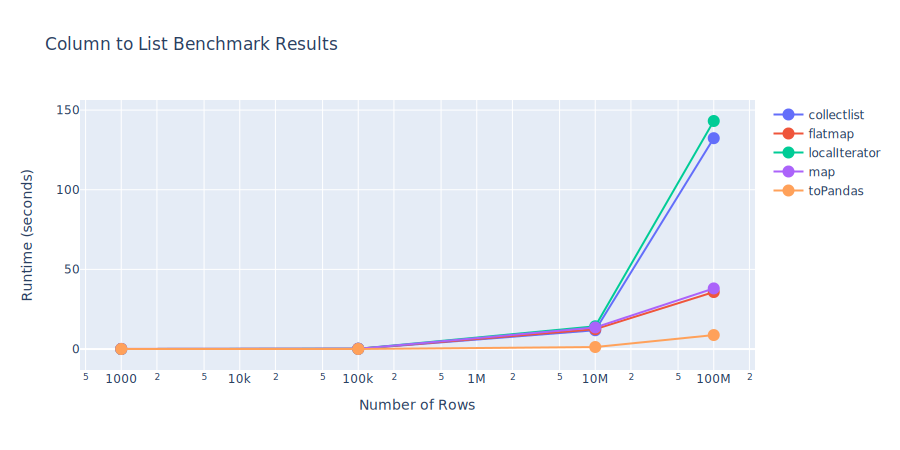

# Column to list performance

In PySpark, there are many approaches to accomplish the same task. For example, a common operation is to collect a column's value into a list. Given a starting dataset containing two columns - mvv and index, Here are five methods to produce an identical list of mvv values using base PySpark functionality.

```python
import pyspark.sql.functions as F
from pyspark.sql import SparkSession
```

```python
spark = SparkSession.builder.getOrCreate()
count_vals = [(random.randint(1, 10),) for _ in range(5)]
df = (
    spark.createDataFrame(count_vals, schema=["count"])
    .withColumn("mvv", F.monotonically_increasing_id())
    .select("mvv", "count")
)
```

---

## Implementations

### 1. toPandas()

```python
list(df.select("mvv").toPandas()["mvv"])
# [0, 1, 2, 3, 4]
```

### 2. flatMap

```python
df.select("mvv").rdd.flatMap(lambda x: x).collect()
# [0, 1, 2, 3, 4]
```

### 3. map

```python
df.select("mvv").rdd.map(lambda row: row[0]).collect()
# [0, 1, 2, 3, 4]
```

### 4. collect list comprehension

```python
[row[0] for row in df.select("mvv").collect()]
# [0, 1, 2, 3, 4]
```

### 5. toLocalIterator() list comprehension

```python
[row[0] for row in df.select("mvv").toLocalIterator()]
# [0, 1, 2, 3, 4]
```

---

## Benchmark Results

Although the resulting lists are equal, the time it takes to create them are not. This difference increases dramatically for larger datasets.




<!--  -->

 This line plot displays the runtime in seconds by a log-transformed dataset size. Here it shows that all implementations have similar performance at 1K and 100k rows. Beyond this row count, toPandas() exhibits a roughly linear increase in runtime while the other methods increase more rapidly.  `toPandas()` is consistently the fastest method across all tested dataset sizes. However, `pyarrow` and `pandas` are not required dependencies of `quinn` so this method will only work with those packages available. For typical spark workloads, the `flatMap` implementation is the next best option to use by default.

## Quinn Implementation

To address these performance results, we updated `quinn.column_to_list()` to check for the correct dependencies and use the fastest method available. If `pandas` and `pyarrow` are available, `toPandas()` is used. Otherwise, `flatmap` is used.

{{code_block('learn_more/column_to_list','column_to_list',[])}}
```python exec="off", result="text" session="learn_more"
--8<-- "python/learn_more/column_to_list.py:column_to_list"
```